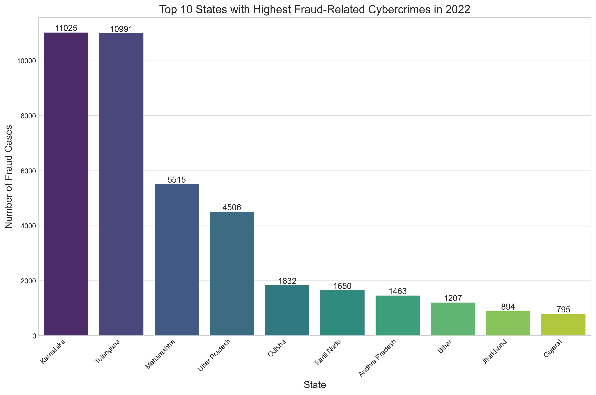
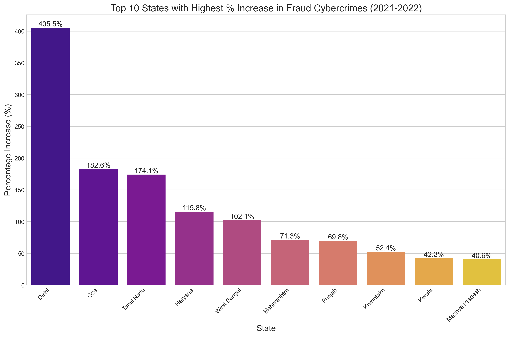
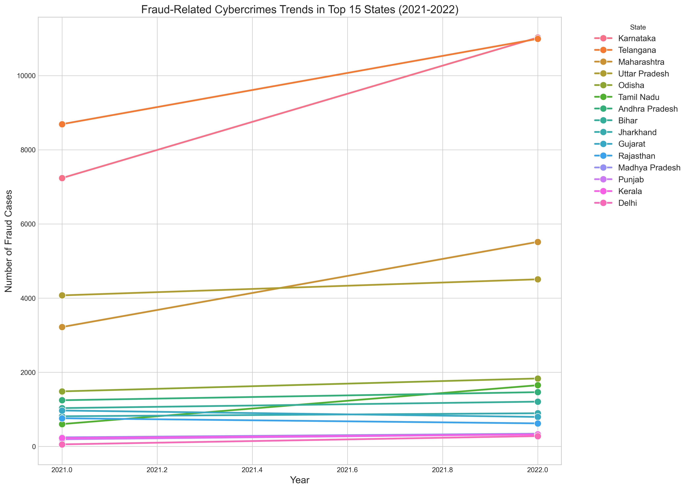
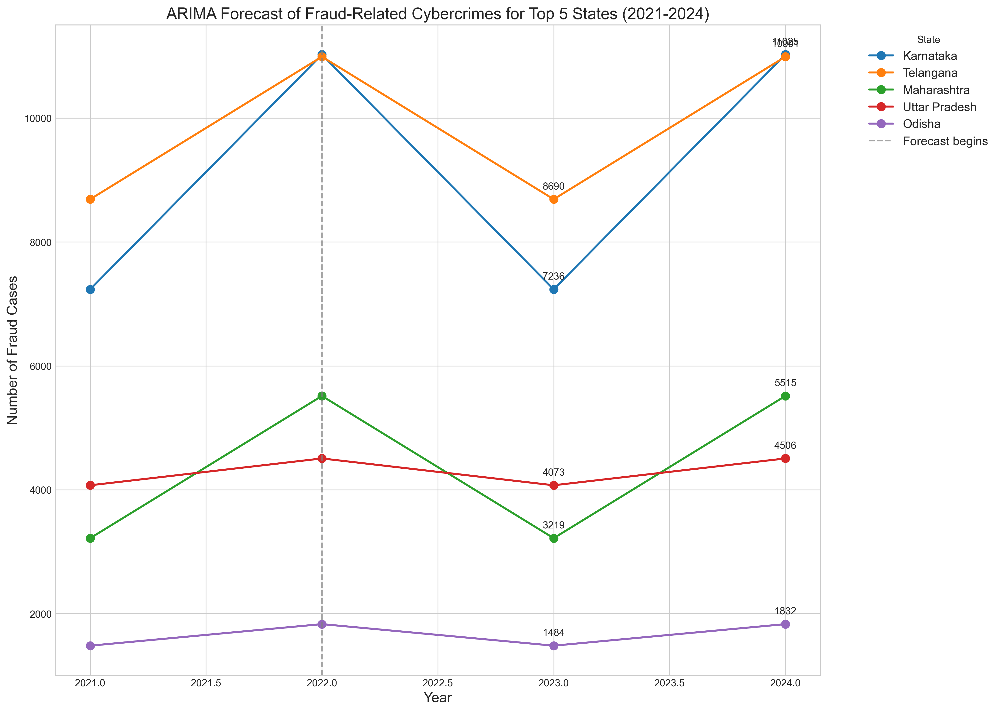
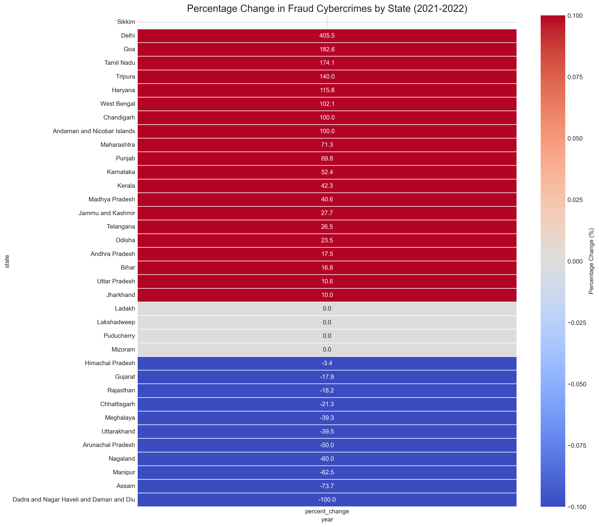

# Fraud-Related Cybercrime Analysis (2021-2022)

This folder contains a comprehensive analysis of how fraud-related cybercrimes evolved across Indian states between 2021 and 2022. The analysis uses data from the National Crime Records Bureau (NCRB) of India and employs time series forecasting (ARIMA) and various visualization techniques to identify trends and patterns.

## Dataset

The analysis is based on the dataset:
- `cyber-crimes-from-ncrb-master-data-year-and-state-wise-number-of-cyber-crimes-committed-in-india-by-types-of-motives.csv`

This dataset contains detailed information about different cybercrime motives across Indian states, including "Fraud or Illegal Gain" which is the focus of this analysis.

## Visualizations Overview

This analysis includes multiple visualizations that provide different perspectives on the evolution of fraud-related cybercrimes across Indian states:

### 1. Top 10 States with Highest Fraud Cases in 2022 (`top_10_states_fraud_2022.png`)

**Description:**
- This bar chart shows the 10 states with the highest number of fraud-related cybercrimes in 2022.
- Each bar represents a state, with the height indicating the absolute number of fraud cases.
- The values on top of each bar show the exact number of reported cases.

**Insights:**
- Identifies which states had the highest fraud cybercrime incidence in 2022.
- Provides a clear ranking of states by fraud case volume.
- Helps policymakers identify high-priority regions for cybercrime prevention efforts.

### 2. States with Highest Percentage Increase (`top_10_states_percent_increase.png`)

**Description:**
- This visualization shows the top 10 states with the highest percentage increase in fraud cybercrime cases from 2021 to 2022.
- Only states with at least 10 fraud cases in 2021 are included to avoid misleading percentage changes from very small baseline numbers.
- The percentage values are displayed on top of each bar.

**Insights:**
- Highlights the states where fraud is growing most rapidly (in relative terms).
- Identifies emerging hotspots that may need increased attention despite potentially lower absolute numbers.
- Reveals potentially concerning trends that may not be apparent when looking at absolute numbers alone.

### 3. Fraud Trends in Top 15 States (`fraud_trend_top_15_states.png`)

**Description:**
- This line graph shows the trend of fraud cases across the top 15 states (by 2022 case volume) over the period 2021-2022.
- Each line represents a state, with markers showing the exact data points for each year.
- The slope of each line indicates how rapidly fraud cases are increasing or decreasing in that state.

**Insights:**
- Provides a direct comparison of trends across multiple states simultaneously.
- Shows which states had the steepest increases or decreases.
- Helps identify states where trends differ significantly from the national pattern.
- Reveals potential correlations in fraud trends between different states.

### 4. ARIMA Forecast for Top 5 States (`arima_forecast_top_5_states.png`)

**Description:**
- This visualization shows the results of time series forecasting using ARIMA (Autoregressive Integrated Moving Average) models for the top 5 states with highest fraud cases.
- The solid lines show historical data (2021-2022), while the extended portions after the vertical dotted line show forecasted values for 2023 and 2024.
- The forecasted values are annotated directly on the chart.

**Insights:**
- Provides predictive analytics for future fraud cybercrime trends.
- Helps authorities prepare resources and countermeasures for anticipated future trends.
- Identifies states where fraud may become a greater problem in the next two years.
- The forecast is based on limited historical data points and should be interpreted as a projection based on recent trends rather than a definitive prediction.

### 5. Percentage Change Heatmap (`fraud_percentage_change_heatmap.png`)

**Description:**
- This heatmap displays the percentage change in fraud cybercrime cases for all states between 2021 and 2022.
- States are sorted by percentage change in descending order.
- The color scale ranges from cool colors (decreases) to warm colors (increases), with the intensity reflecting the magnitude of change.
- The exact percentage change values are annotated in each cell.

**Insights:**
- Provides a comprehensive view of changes across all states in a single visualization.
- The color gradient makes it easy to identify states with extreme changes.
- Shows the full spectrum of changes from the largest increases to the largest decreases.
- Helps identify potential regional patterns in fraud trends.

## Analysis Methodology

The analysis employs several key methodologies:

1. **Data Filtering and Preparation**:
   - Focusing on "Fraud or Illegal Gain" as the cybercrime motive
   - Limiting analysis to 2021-2022 data
   - Removing all-India aggregates to focus on state-level patterns

2. **Time Series Analysis**:
   - Using ARIMA models to forecast future trends based on historical data
   - Simple AR(1) model is used due to limited data points

3. **Comparative Analysis**:
   - Examining both absolute numbers and percentage changes
   - Setting thresholds to avoid misleading interpretations from small baseline numbers

## Main Findings

The analysis reveals several key insights:

1. **State-wise Distribution**: Fraud-related cybercrimes are highly concentrated in specific states, with significant disparity between the highest and lowest states.

2. **Growth Trends**: Most states experienced an increase in fraud cases between 2021 and 2022, though the magnitude varies considerably.

3. **Emerging Hotspots**: Some states with relatively lower absolute numbers are showing concerning growth rates, suggesting potentially emerging cybercrime hotspots.

4. **Future Projections**: Based on ARIMA forecasting, the trend of increasing fraud cases is likely to continue in many states through 2024, particularly in states already showing high growth rates.

## Using the Analysis Script

The Python script `fraud_cybercrime_analysis.py` contains the full code used to generate these visualizations. It can be executed to regenerate all the visualizations or modified to create additional analyses.

Key dependencies include:
- pandas
- numpy
- matplotlib
- seaborn
- statsmodels (for ARIMA modeling)
- sklearn

## Conclusion

This analysis provides a comprehensive overview of fraud-related cybercrime trends across Indian states, highlighting both current hotspots and emerging areas of concern. The visualizations offer multiple perspectives on the data, from absolute rankings to growth rates and future projections, providing valuable insights for policymakers, law enforcement agencies, and cybersecurity professionals.