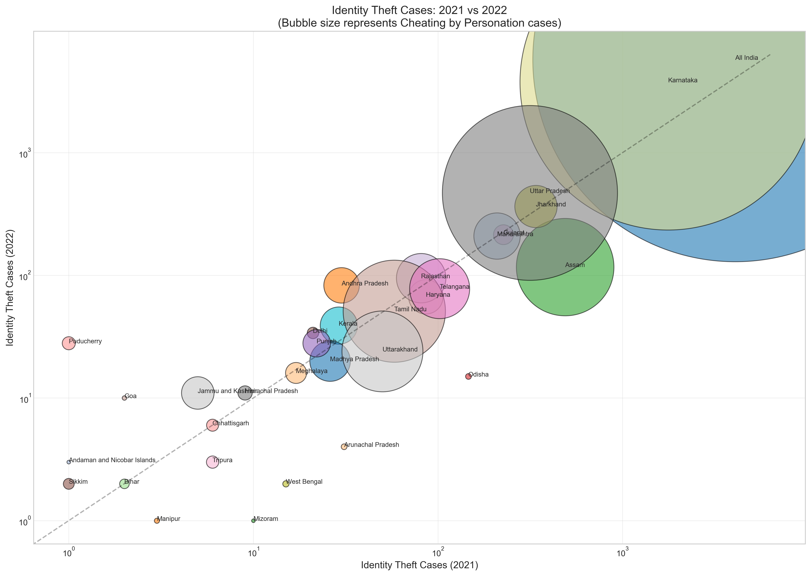
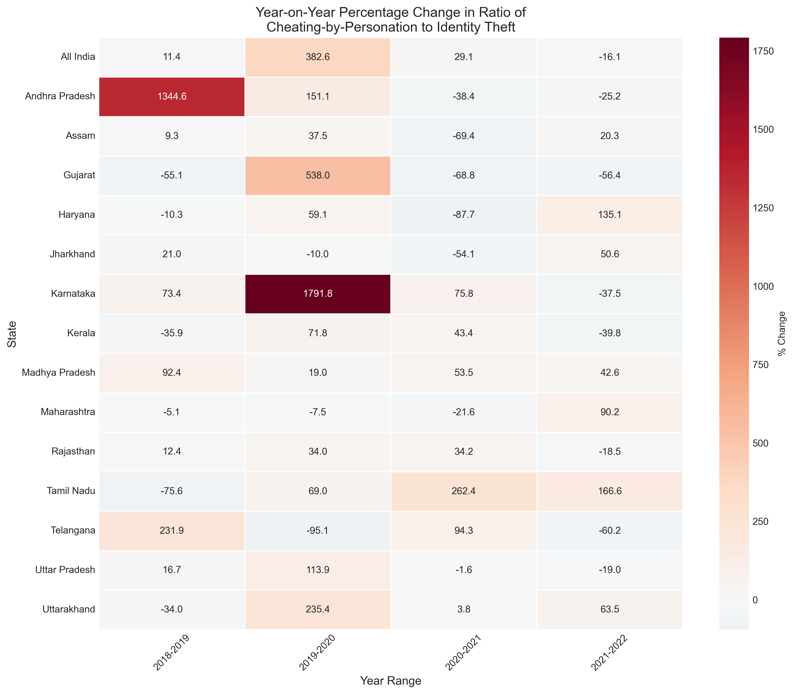
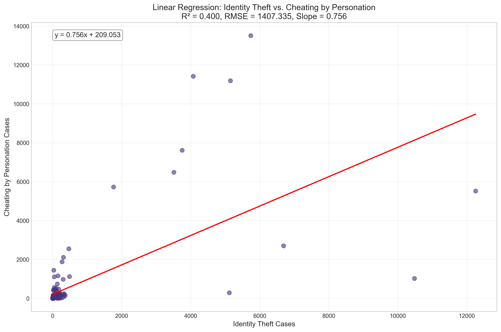
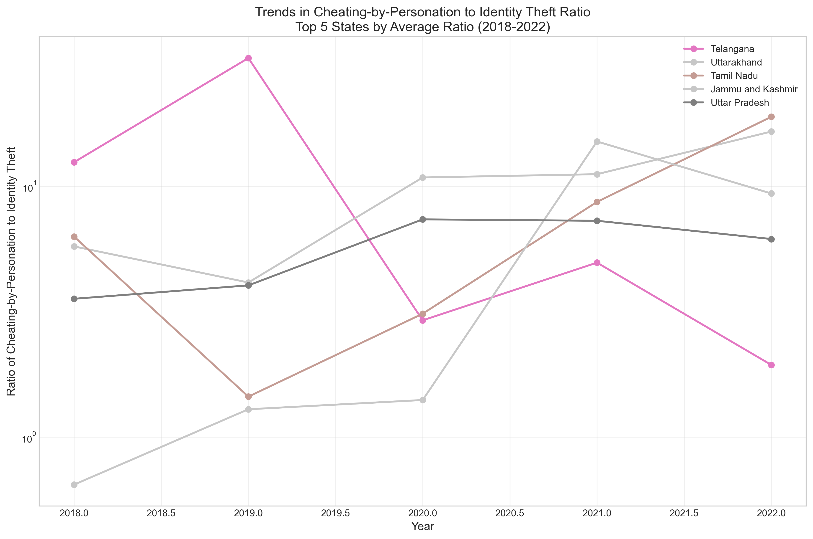
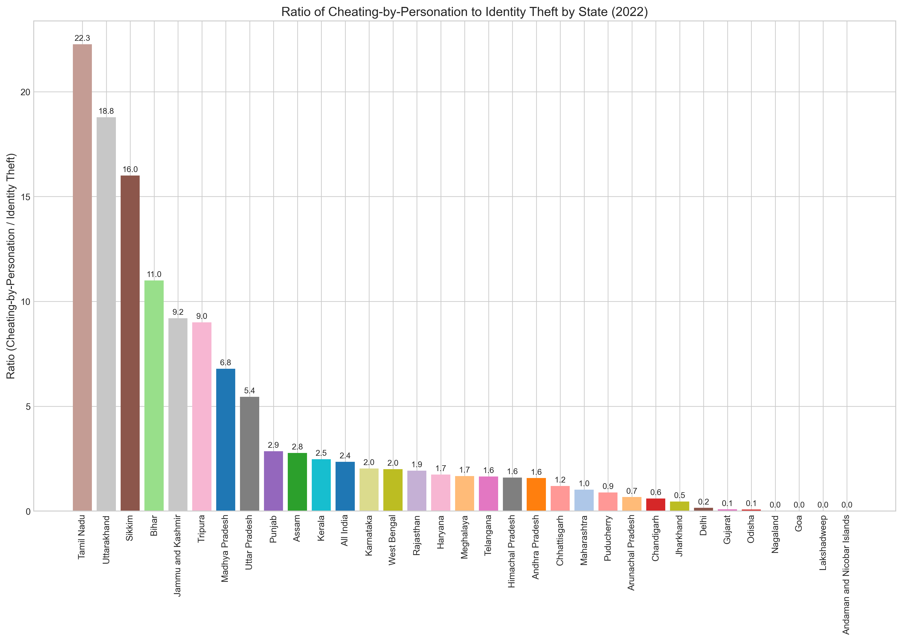

# Analysis of Cheating-by-Personation vs Identity Theft Crimes in India (2018-2022)

## Project Objective

This project analyzes the ratio of cheating-by-personation to identity theft crimes across Indian states from 2018 to 2022. The primary research question addressed is:

> How does the ratio of cheating-by-personation to identity theft crimes vary across states from 2018 to 2022?

The analysis employs regression techniques (Linear Regression) to explore relationships between these two types of cyber crimes and uses various data visualization methods to illuminate patterns across states and years.

## Dataset Used

The analysis uses the National Crime Records Bureau (NCRB) dataset:
- **Dataset name**: `cyber-crimes-from-ncrb-master-data-year-and-state-wise-types-of-cyber-crimes-committed-in-violation-of-it-act.csv`

This dataset was selected because:
1. It contains detailed state-wise data on cyber crimes committed under the IT Act
2. It specifically categorizes "Identity Theft" and "Cheating by personation by using computer resource" under Computer Related Offences
3. The dataset covers our target period (2018-2022) with consistent reporting mechanisms
4. It provides sufficient granularity for state-level analysis and year-wise comparisons

## Analysis Summary

The analysis follows these key steps:

1. **Data Preprocessing**:
   - Filtered the dataset to focus only on "Identity Theft" and "Cheating by personation by using computer resource" categories
   - Calculated the ratio between these two crime types for each state and year
   - Handled missing values and outliers to improve visualization quality

2. **Exploratory Data Analysis**:
   - Examined descriptive statistics for both crime categories and their ratio
   - Identified states with the highest ratios and greatest year-to-year changes
   - Explored trends in the data across the five-year period (2018-2022)

3. **Regression Analysis**:
   - Applied linear regression to understand the relationship between the number of identity theft cases and cheating-by-personation cases
   - Calculated metrics such as R² and RMSE to evaluate the model fit
   - Derived insights about the correlation between these two types of crimes

4. **Key Findings**:
   - There is considerable variation in the ratio of cheating-by-personation to identity theft across Indian states
   - Some states show a clear trend of increasing or decreasing ratios over the five-year period
   - The relationship between the raw counts of these crimes varies by state, suggesting different cybercrime patterns or reporting mechanisms
   - Year-over-year changes in the ratio can be substantial, indicating evolving cybercrime landscapes

## Visualizations Chosen

The following five visualization types were selected to effectively address the research question:

1. **Bubble Chart Comparison (2021 vs 2022)**:
   - Shows the relationship between identity theft cases in 2021 and 2022
   - Bubble size represents the number of cheating-by-personation cases
   - Allows for multi-dimensional analysis that captures all three variables of interest
   - Helps identify states with unusual patterns or significant year-over-year changes
   

2. **Percentage Change Heatmap**:
   - Visualizes the year-over-year percentage changes in the ratio of cheating-by-personation to identity theft
   - Uses color intensity to highlight increases (red) and decreases (blue)
   - Provides an intuitive way to track ratio changes across multiple states and years simultaneously
   - Helps identify patterns of consistent increases or decreases
   

3. **Linear Regression Analysis Plot**:
   - Illustrates the relationship between identity theft cases and cheating-by-personation cases
   - Includes the regression line with equation and statistical metrics (R², RMSE)
   - Helps understand whether there's a predictable relationship between these crime types
   - Useful for identifying outliers and understanding the overall correlation
   

4. **Ratio Trends for Top 5 States**:
   - Tracks the ratio of cheating-by-personation to identity theft over time for the five states with the highest average ratios
   - Uses a line chart with distinct colors for each state to show year-to-year changes
   - Helps identify states with unusual patterns or significant fluctuations
   - Provides insights into whether states maintain consistent ratios or experience volatility
   

5. **State-wise Ratio Bar Chart (2022)**:
   - Shows the ratio of cheating-by-personation to identity theft for all states in the most recent year
   - Uses a simple bar chart format for clear comparison across states
   - Helps identify which states have disproportionately high or low ratios
   - Provides a snapshot of the current national landscape of these cybercrime ratios
   

## Execution Instructions

To run the analysis:

1. Ensure the required Python libraries are installed (see Dependencies section below)
2. Verify the dataset file is in the correct location (or update the `DATA_PATH` variable in the script)
3. Run the Python script:
   ```
   python cybercrime_personation_identity_analysis.py
   ```
4. The visualizations will be saved in the current directory as PNG files

## Dependencies

The analysis requires the following Python libraries:
- pandas
- numpy
- matplotlib
- seaborn
- scikit-learn

You can install all required dependencies using pip:
```
pip install pandas numpy matplotlib seaborn scikit-learn
```

---

This analysis was completed as part of the data analysis project for Question 8 in April 2025.